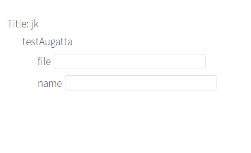
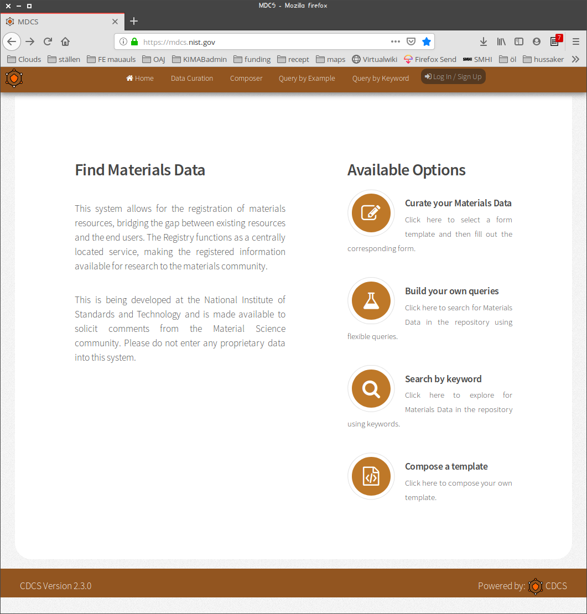

% the Swedish instance of MDCS for AM : amdata
% N. Stenberg and G. Lindvall

# Today

- whoami? (sorry - the mandatory *"presentation round"*)
	- as short as possible: **Not!** a full bio.
- The day:  **DIP-C** (newly made up acronym!)
	- datacentric 
	- interactive (We hope...)
	- pragmatic
	- collaborative

# Why? (motivation)

## 

Materials data development is **incremental**. Everyone takes small steps
and it is only by communicating **rapid growth** can be obtained.

## alas!

**amdata.proj.kth.se**   ---  a collaborative backbone.

# The service

- **amdata.proj.kth.se** is owned by *the Arena*
- It is a service for **You!**
- *Only* curation of materials data.
- Easy to use:  web or API

# more motivation

\bco\co

**Share your results**

and you will receive a multitude of information.

\co

**The future needs data too**

By saving current data future development will be in uptempo!

\eco

# example

- data driven development
- 

# What does data look like?

- a multitude of file formats
	- some even proprietary
- non uniform structure
- naming is not uniform
- fairly often just data fragments
- data is spread over several HDs and servers
- duplicates yield uncertainty
- no version control
- ...

# amdata.proj.kth.se

- It is a server and a Database
- code developed by NIST within the scope of MGI
- based on open packages (django, mongoDB, ...)
- hosted by KTH-IT 
	- fantastic bandwidth
	- no own commercial agenda
	- solid
	- cheap

# Features of amdata

\bco\co

- web interface
- API
- user centred
- structure based on *templates*

\co

\eco

# workflow

- define a template
- fill the fields with data
- save it

Several templates can coexist

**Suggestion is to just have a handful of templates.**

# Now, it is time for template:ing

\cent{Your turn to participate!\\ \swb It is one of these interactive moments}
